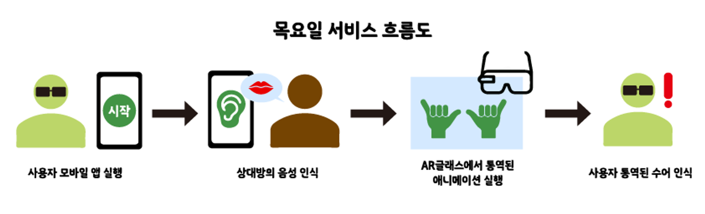
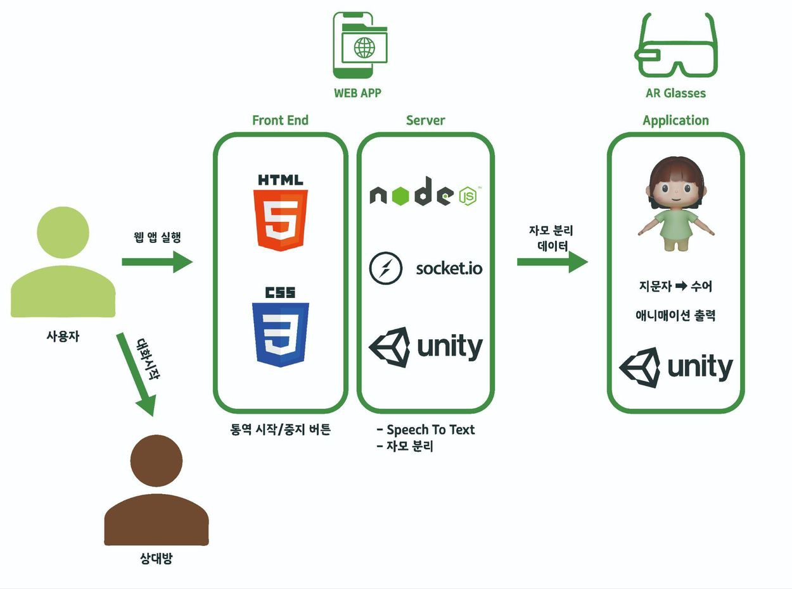
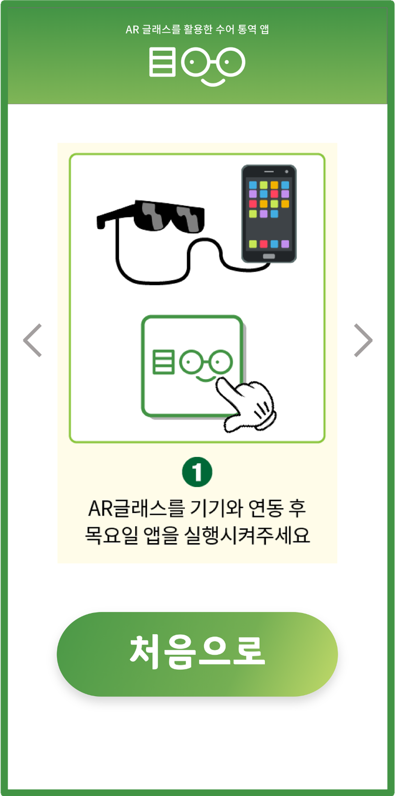

# Stt_Web
## 목요일 웹 앱

* 목요일의 AR 글래스 앱은 Thursday_AR에서 확인 ->
[목요일 AR 글래스 앱 Github 바로가기](https://github.com/dooruz/Thursday_AR)

> 기획

- 청각장애인들은 일상 속에서 우리가 상상하지 못할 여러 불편함을 겪고 있다. 비수어 사용자를 대상으로 수어를 음성으로 번역하는 서비스는 많이 존재하지만, 청각장애인을 위한 수어 통역 서비스는 상용화되어있지 않다. 우리는 이 점에 집중해 청각장애인들의 편리함을 위한 서비스가 필요하다고 생각해 목일을 개발했다.

> 프로젝트 소개

- ‘목(目)요일’은 청각장애인들에게 음성을 수어로 통역해주는 AR 애플리케이션이다. AR 글래스를 활용해 실제 상대방과 대화하는 것처럼 느끼게 하며 AR 글래스를 통해 통역된 수어를 3D 캐릭터로 보여주도록 한다.
- ‘목(目)요일’에서 ‘목’은 ‘나무 목(木)‘이 아닌 ’눈 목(目)’자를 의미하며 일상이라는 의미를 담은 ‘요일’과의 합성어로 눈으로 보는 일상이라는 뜻을 가지고 있다.
- AR글래스는  Nreal사의 제품을 사용했다.

> 서비스 흐름도 및 구성도

- 사용자 웹 애플리케이션 접속 → 통역 버튼 클릭 → 음성인식 → 음성 텍스트화 → 텍스트 클라이언트에서 자음, 모음 분리 → AR글래스로 분리된 자음과 모음에 알맞은 캐릭터 애니메이션 등장
  
- 서버-클라이언트 통신 과정
    - 서버에서 상대방의 음성을 인식한다.
    - 음성 인식은 HTTP 모듈을 활용해 받아온다.
    - 인식된 음성을 변수로 전환해 배열로 받아와 유니코드 분석법으로 한글 문자를 초성, 중성, 종성으로 나눈다.
    - 초성은 유니코드 값에 한글 시작점을 뺀 후에 중성과 종성 개수를 나눠 구한다.
    - 중성은 현재의 한글 코드 값에 한글 시작점의 차이 값을 종성 개수로 나눈다.
    - 종성도 마찬가지로 차이 값에 28의 나머지로 구한다.
    - 초성, 중성, 종성으로 나눌 때마다 SendText함수를 선언해 분리된 자음, 모음을 배열에 삽입한다.
    - draw() 함수에서 전체 문장과 분석된 배열 데이터를 클라이언트에게 송신한다.
    - 클라이언트에서 우선 서버가 연결됐는지 확인한다.
    - 서버 측으로 메세지를 보내면 호출되는 함수인 OnMessage함수로 서버에서 전체 문장과 송신한 배열 데이터를 받는다.
    - AR 글래스 상에서 상대방의 얼굴 하단에 자막이 위치하게 된다.

> 프로젝트 사진

.png).png) | 
 |
 | 

> 기능 설명

1. 청각장애인과 대화 할 비수어 사용자가 사용하는 앱이다.
2. STT 기능으로 앱을 키고 말을 하면 AR글래스 앱으로 데이터가 전송된다.
   - 무선 인터넷이 연결되어 있어야 한다.
   - 통역 시작을 누른 후 말한다.
   - 음성을 텍스트로 변환한 후 원본의 텍스트는 문장데이터로 전송된다.
   - 문장 데이터는 초성, 중성, 종성으로 분리되어 전송된다. 
3. How to use 버튼으로 어떻게 사용하는지 설명을 볼 수 있다.